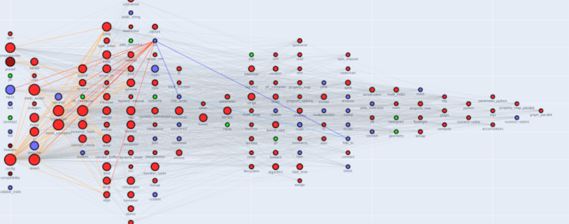

# Boost Dependency Graph



This is a small application that generates a visual representation of the internal Boost dependencies.

The complete report is available on https://alandefreitas.github.io/boostdep_graph/

## Quickstart

Clone the boost super-project:

```bash
git clone https://github.com/boostorg/boost.git -b develop boost
cd boost
git submodule update --init --recursive
```

If you don't have `b2`, execute

```bash
.\bootstrap
```

Install boostdep:

```bash
b2 tools/boostdep/build
```

Generate the graph:

```bash
python main.py --boost-root /path/to/boost --boostdep boostdep
```

## Output format

By default, the application will generate the dependency overview. You can save your results to an html file instead
with the `--output html` option.

```bash
python main.py --boost-root /path/to/boost --boostdep boostdep --output html
```

To highlight the dependencies for a list of libraries, use the `--libs` option:

```bash
python main.py --boost-root /path/to/boost --boostdep boostdep --libs url
```

The `report` output format will generate the overview, one page for each library, and create links:

```bash
python main.py --boost-root /path/to/boost --boostdep boostdep --output report
```

## Interpreting the graph

Many aspect of the library are represented in the network graph:

- Axes
    - The x-axis represents the dependency level of each library
    - The y-axis represents the number of libraries at each level
- Vertices
    - The vertex size is proportional to how many other modules depend on it
    - The vertex colors represent the minimum C++ standard supported by a library
    - The vertex symbol:
        - Circle: default
        - Diamond: there are partial alternatives to this library in the C++ standard library
            - Note that almost no library can be completely replaced by its `std` counterpart
        - Pentagon: patched modules / proposals
    - Vertex border:
        - Orange: direct dependencies
        - Light orange: transitive dependencies
        - Blue: direct reverse dependencies
        - Light blue: transitive reverse dependencies
        - Dark green: modules in the same category
- Edge colors:
    - Orange: direct dependencies
    - Light orange: transitive dependencies
    - Blue: direct reverse dependencies
    - Light blue: transitive reverse dependencies
- Hover text includes:
    - Module name
    - Min. C++ standard supported
    - Authors
    - Abstract
    - Dependencies
    - Transitive dependency paths
    - Categories

The information about libraries comes from the metadata provided by each library in `meta/libraries.json`. For the min.
C++ standard supported, if no metadata is provided, the highest standard between direct dependencies is considered.
